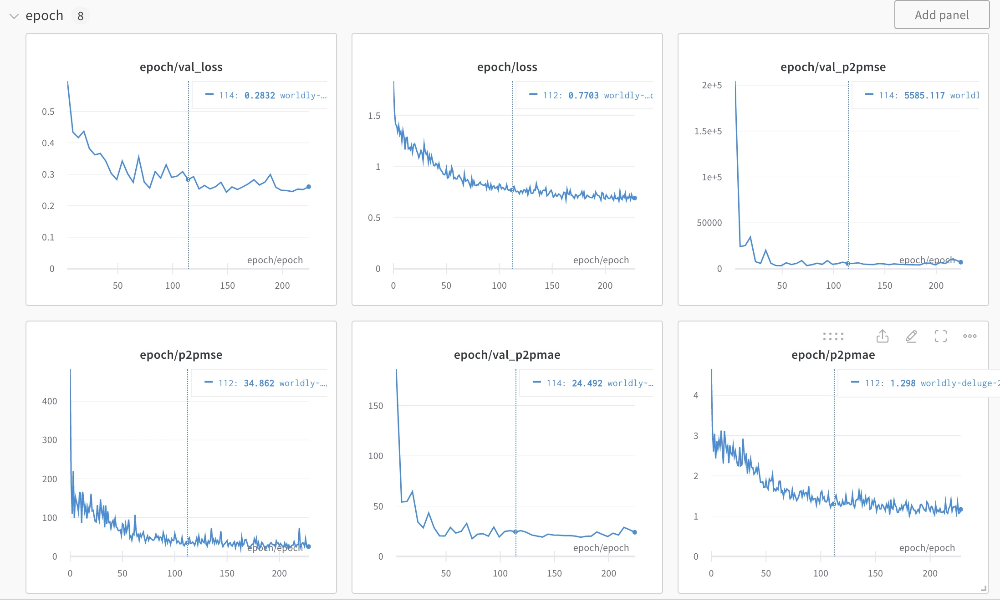

# tf.keras implementation of P2PNet
- This repository contains codes for P2PNet Crowd Counting implemented in tensorflow.keras. *(UNDER DEVELOPMENT)*. 
- The code is prepared for easy backbone and FPN replacement.
- **Disclaimer**. As I am rather a user than a writer of DL, don't blame me for any inefficiency or misimplementation of the citing paper. This was created for my personal use. Pull requests and advices are really welcome. Issues are also welcome but cannnot guarantee any solution.

Prediction (tentative)


- [tf.keras implementation of P2PNet](#tfkeras-implementation-of-p2pnet)
  - [Quick Demo](#quick-demo)
  - [Instructions](#instructions)
    - [Installation](#installation)
    - [Demo](#demo)
    - [Training with SHHA dataset](#training-with-shha-dataset)
    - [Details](#details)
      - [Import Libraries](#import-libraries)
      - [DataLoader](#dataloader)
      - [Load the model](#load-the-model)
    - [Visualize model structure](#visualize-model-structure)
    - [Compile \& Train](#compile--train)
    - [Predict, Post Process, and Visualize](#predict-post-process-and-visualize)
  - [To do](#to-do)
  - [Unresolved Issues](#unresolved-issues)
  - [Misc.](#misc)
    - [Reference](#reference)
    - [Wandb compatibility](#wandb-compatibility)
      - [WandbLogger](#wandblogger)
  - [Comparison to the official repo.](#comparison-to-the-official-repo)
    - [Basics](#basics)
    - [Default Hyperparameters](#default-hyperparameters)

## Quick Demo
Open this notebook in colab and execute.

[](https://colab.research.google.com/github/totti0223/P2PNet_tfkeras/blob/master/notebooks/P2PNet_colab_demo.ipynb)

## Instructions

### Installation
*Installation scripts are not ready yet. this is a place holder*
1. Clone the repository
2. ```cd THISREPO```
3. ```pip install -r requirements.txt```
     - tensorflow
     - albumentations
     - loguru
     - pycocotools
     - scipy
     - opencv-python
     - scikit-image

### Demo
### Training with SHHA dataset
1. Download SHHA dataset [here](https://www.kaggle.com/datasets/tthien/shanghaitech)
2. Convert .mat format to COCO format. [See Notebook](./notebooks/convert_shanghaitechdataset.ipynb).
3. Train (Training script will be available in the future. mean while, you can write your own based on the following details)


### Details

#### Import Libraries
```python
import tensorflow as tf
import tensorflow.keras.backend as K
from tensorflow.keras.utils import plot_model

import matplotlib.pyplot as plt
import cv2
import numpy as np
import scipy

import albumentations as A
import wandb
from wandb.keras import WandbMetricsLogger, WandbEvalCallback

from utils.dataloader import DataLoader
from utils.losses import P2PLoss
from utils.metrics import P2PMAE, P2PMSE
from utils.models import P2PNet
from utils.general import postprocess

```

#### DataLoader
How to load SHHA dataset for example.
```python

# Define your custom augmentation here.
# Some image are small, so introduce PadIfNeeded prior to RandomCrop
# 

train_aug = A.Compose([
    A.Blur(p=0.2),
    A.ColorJitter(p=0.2),
    A.HorizontalFlip(p=0.5),
    A.RandomScale(scale_limit=(-0.3,0.3), always_apply=False, p=0.5),
    A.PadIfNeeded(min_height=128, min_width=128,
                    border_mode=0, p=1.0),
    A.RandomCrop(width=128, height=128, always_apply=True),
], keypoint_params=A.KeypointParams(format='xy', label_fields=['class_labels']))

val_aug = A.Compose([
    A.PadIfNeeded(min_height=256, min_width=256,
                    border_mode=0, p=1.0),
    A.CenterCrop(width=256, height=256, always_apply=True),
], keypoint_params=A.KeypointParams(format='xy', label_fields=['class_labels']))

# Dataloader

train_dt = DataLoader(
    "ABSOLUTE_PATH_TO_THE_JSON_DIR/shanghaitech_train.json",
    "ABSOLUTE_PATH_TO_THE_TRAINVAL_IMAGE_DIR/ShanghaiTech/part_A/train_data/images",
    batch_size=8,augmentations=train_aug)
val_dt = DataLoader(
    "ABSOLUTE_PATH_TO_THE_JSON_DIR/shanghaitech_val.json",
    "ABSOLUTE_PATH_TO_THE_TRAINVAL_IMAGE_DIR/ShanghaiTech/part_A/train_data/images",
    batch_size=8,augmentations=val_aug)
test_dt = DataLoader(
    "ABSOLUTE_PATH_TO_THE_JSON_DIR/shanghaitech_test.json",
    "ABSOLUTE_PATH_TO_THE_TEST_IMAGE_DIR/ShanghaiTech/part_A/test_data/images",
    batch_size=1,augmentations=False)
```

The output shape of the DataLoader
```python
for images, y_trues in train_dt:
    print(images.shape)  # ex.(8, 256, 256, 3)
    print(y_trues.shape)  # ex.(8, N, 3)
    break
```
- The dataloader inherits the tf.keras.utils.Sequence class utilizing pycocotools.
- Outputs 
  - Image (batch, height, width, channel)
    - To handle batch, image size must be the same.
    - Image size must be divisable by 128. (more exactly, divisable by stride ex. 8 by default)
  - Labels (batch, number of points, ZERO PADDED xycoords and sparse labels)
    - To handle batch, number of points must be same within batch. However the number of points differ by image, so the xycoords and sparse labels are zero padded to the size of the maximum number of points within the batch.

```python
print(y_trues)
# [[[241.81851   230.38333     1.       ]
#   [230.61111   233.02037     1.       ]
#   [230.28148   241.59074     1.       ]
#   ...
#   [  0.          0.          0.       ]
#   [  0.          0.          0.       ]
#   [  0.          0.          0.       ]]

```


#### Load the model
Implemented via tf.keras.models.Model class.
```python
K.clear_session()
# Since I determine the output layer of backbone by the model name, 
# must clear the session before loading the model to ensure proper loading.
# In keras, pretrained models have a layer name dynamically generated
# without overlap between models, so the layer name of the first load and second load changes.

# Default P2PNet settings mimicking the official paper.
model = P2PNet(
  input_shape=(None, None, 3),
  backbone_name = "vgg16",
  preprocessing=True,
  feature_size = 256,
  no_reference_points = 4,
  no_classes = 1,
  gamma=100
)

# input_shape: keep it None,None,3 else you want a fixed size input model.
# backbone_name: refer to backbone.py. currently compatible with "vgg16" and "mobilenetv3_large".
# preprocessing: boolean. wheather to include preprocessing layer in the model. if false, must tweek the dataloader for compatibility.
# feature_size: shared conv filter number for the non backbone layers.
# no_reference_points: refer to the paper.
# no_classes: must be 1 for now.
# gamma: value multiplied to the raw output of the regression layer, prior to the addition of reference point layer.

# In the case of MobileNetV3Large with feature size 512, reference points 1
model = P2PNet(
  input_shape=(None, None, 3),
  backbone_name = "mobilenetv3_large",
  preprocessing=True,
  feature_size = 512,
  no_reference_points = 1,
  no_classes = 1,
  gamma=100
)
```
### Visualize model structure
```python
plot_model(model.build_graph(), show_shapes=True, to_file='model.png')
```
This is the visualized model structure with VGG16 backbone with feature size of 256. The model receives arbitrary input shape (divisable by 128) but are fixed to 128 for visualization.


### Compile & Train
Since layer-wise learning rate specification is not implemented yet, instead a warmup run with backbone fronzen is introduced.

```python
# callbacks
from wandb.keras import WandbMetricsLogger

wandb.init(project="crowd_counting")
ckpt = tf.keras.callbacks.ModelCheckpoint(filepath="ckpt/230426_crowd_256_2fpn_{epoch}",
                                          monitor='val_loss',
                                          save_best_only=True,
                                          save_weights_only=True,
                                          mode = "min",
                                          verbose=1)
es = tf.keras.callbacks.EarlyStopping(monitor='val_loss',
                                      patience=100,
                                      restore_best_weights=True,
                                      verbose=1,
                                      mode="min")

ws = WandbMetricsLogger()
```

```python
# warmup
optimizer = tf.keras.optimizers.RMSprop(learning_rate=1e-3)
for layer in model.layers:
    if 'backbone' in layer.name:
        logger.info("Freezing Layer: {}".format(layer.name))
        layer.trainable = False
model.compile(loss = P2PLoss(), optimizer=optimizer, metrics = [P2PMAE(),P2PMSE()])
model.fit(train_dt,epochs=15,workers=15, use_multiprocessing=True)

# main run
optimizer = tf.keras.optimizers.RMSprop(learning_rate=1e-4)
for layer in model.layers:
    if 'backbone' in layer.name:
        logger.info("UnFreezing Layer: {}".format(layer.name))
        layer.trainable = True        
model.compile(loss = P2PLoss(), optimizer=optimizer, metrics = [P2PMAE(),P2PMSE()])
model.fit(train_dt,
          validation_data = val_dt,
          validation_freq=10,
        epochs=1000,
        workers=15, 
        use_multiprocessing=True, callbacks=[ckpt, es, ws])
```

### Predict, Post Process, and Visualize
```python
# load checkpoint
model.load_weights("CKPT_PATH")

plt.figure(figsize=(20,10))
for i, (images, y_trues) in enumerate(test_dt):
    # single image for test_dt
    plt.subplot(2,4,i+1)
    plt.axis('off')
    preds = model.predict(images, verbose=0)[0]
    coords = postprocess(preds)
    for coord in coords:
        cv2.circle(images[0], (int(coord[0]),int(coord[1])), 5, (255,0,0),-1)
    plt.imshow(images[0].astype(np.uint8))
    if i == 7:
      break
plt.subplots_adjust(left=0, bottom=0)
```


- The model prediction outputs array with the following shape.
  - (batch, num of proposal points, xycoords and dense class logits)
  - x y coordinate corresponds to original image coordinate, so no coordinate conversion is needed.
  - for single class detection, the logit column size are 2, background is included for the first column. 
  - postprocessing is done by a simple function (see utils.general.postprocessing)

```python
print (preds.shape)  # (1, 49152, 4)
print(preds)
# [[[ 2.36530328e+00  5.79315901e-01  1.90447676e+00 -6.00669289e+00]
#   [ 7.27695656e+00 -3.69676018e+00  5.53296089e+00 -6.97399282e+00]
#   [ 2.31764102e+00  1.98200264e+01  4.53954935e+00 -6.11005306e+00]
#   ...
#   [ 1.02179706e+03  7.58234680e+02  3.46409774e+00 -3.94872379e+00]
#   [ 1.01951727e+03  7.79733521e+02  4.11594057e+00 -5.83579206e+00]
#   [ 1.01960858e+03  7.52482849e+02  5.38174582e+00 -2.88597417e+00]]]
```

## To do
- Write custom WandbEvalCallback class to visualize validation output in browser.
- Implement nAP.
- Keypoint safe random crop in albumentations.
- Layerwise learning rate implementation.
- Cross Validation Snippetts
- Retreive Performance against SHHA dataset.


## Unresolved Issues
- The tensorflow keras model is coded by subclass API. therefore model can be loaded via checkpoint only. Looking for a workaround to save the model via SavedModel, however have not found such solution yet.
- Training runs fine, however the below Warning message is displayed. This does not affect the training process, but I don't know why this occurs.
- 
  ```bash
  [/device:CPU:0] (DEBUG INFO) Executor start aborting (this does not indicate an error and you can ignore this message): INVALID_ARGUMENT: You must feed a value for placeholder tensor 'Placeholder/_0' with dtype int32
          [[{{node Placeholder/_0}}]]
  ```

## Misc.

### Reference 

- [The P2PNet Paper in arxiv](https://arxiv.org/abs/2107.12746)

- [Official github repository](https://github.com/TencentYoutuResearch/CrowdCounting-P2PNet)

  - **IMPORTANT**. 
    - To avoid legal issues, I tentatively set the license following the [official](https://github.com/TencentYoutuResearch/CrowdCounting-P2PNet/blob/main/LICENSE). However, after confirmation, can release the repo as other license format. Read the following note.
  - **ADVICE WANTED**. 
    - The original repo states that any "with modification" of the repo will be restricted to the original license. However I wrote this code from scratch reading the paper, and believe is not a derivative, therefore I beleive I can set any license I want. 
    - Nonetheless, I can not assure to any third person for use of this repo in other license format, as I am not a professional in this field, as the context of "with modification" is vague to me.
    - If someone can confirm/assure that this repo codes are safe to set my own license, I can change the LICENCE as soon as possible. 

- [detr-tensorflow](https://github.com/Visual-Behavior/detr-tensorflow) 
  - Borrowed codes around Hungarian Matching Algorithm* and Categorical Cross Entropy Loss. This repo is a MIT License, so this should be not a problem upon custom license as long as I cite the repo.
  - Note. In the detr-tensorflow repository, losses are calculated per image via for loop and stored in list for further calculation. In this repo, I used tf.map_fn instead to deal with tf.keras graph scope problems.

    ```python
    label_cost, points_cost = tf.map_fn(
        lambda i: calculate_loss(i),
        elems=tf.range(tf.shape(predicted_points)[0]),
        fn_output_signature=(tf.float32, tf.float32)
    )
    ```

### Wandb compatibility

#### WandbLogger


## Comparison to the official repo.
### Basics
| | Official | This repo |
| --- | --- | --- |
| Framework | pytorch | tf.keras |
| Backbone | VGG16 | VGG16<br>MobileNetV3Large<br>(Will be compatible with other tf.keras.applications models) |
| FPN | Output of 1/8 + 1/16  | Output of 1/8 + 1/16 |
| Loss | L2; F.mse_loss and Cross Entropy Loss | L2 and Sparce Cross Entropy Loss |
| Augmentation | - Random Scaling [0.7, 1.3]<br>- Random Crop [128,128]<br> - Random Horizontal Flip | Customizable through Albumentations library.
| Data Source Format| ShanghaiTech .mat file<sup>1</sup> | COCO bbox format |
| Metric | nAP, MAE, MSE | MAE|
| Other Hyperparameters |  | See table below |

<sup>1</sup> A Dataloader for .mat file  https://github.com/TencentYoutuResearch/CrowdCounting-P2PNet/issues/8

### Default Hyperparameters
| Variable Name | Description | Official | This repo |
| --- | --- | --- |--- |
| --lr | Learning rate | 1e-4 | N.A.|
| --lr_backbone | Learning rate for the backbone | 1e-5 | N.A. |
| --lr_drop | Epoch interval to drop learning rate | 3500 | N.A. |
| --clip_max_norm | Maximum norm of gradient for clipping | 0.1 | N.A. |
| --set_cost_class | Class coefficient in matching cost | 1 | 1 |
| --set_cost_point | L1 point coefficient in matching cost (*tau1*) | 0.05 | 0.05 |
| --point_loss_coef | Coefficient for point loss (*lambda2*) | 0.0002 | 0.0002 |
| --eos_coef | Relative classification weight of the no-object class (*lambda1*)  | 0.5 | 0.5 |
